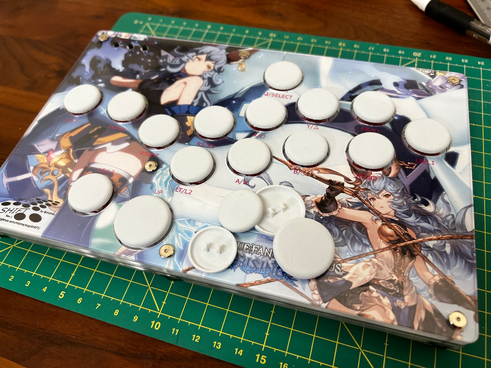
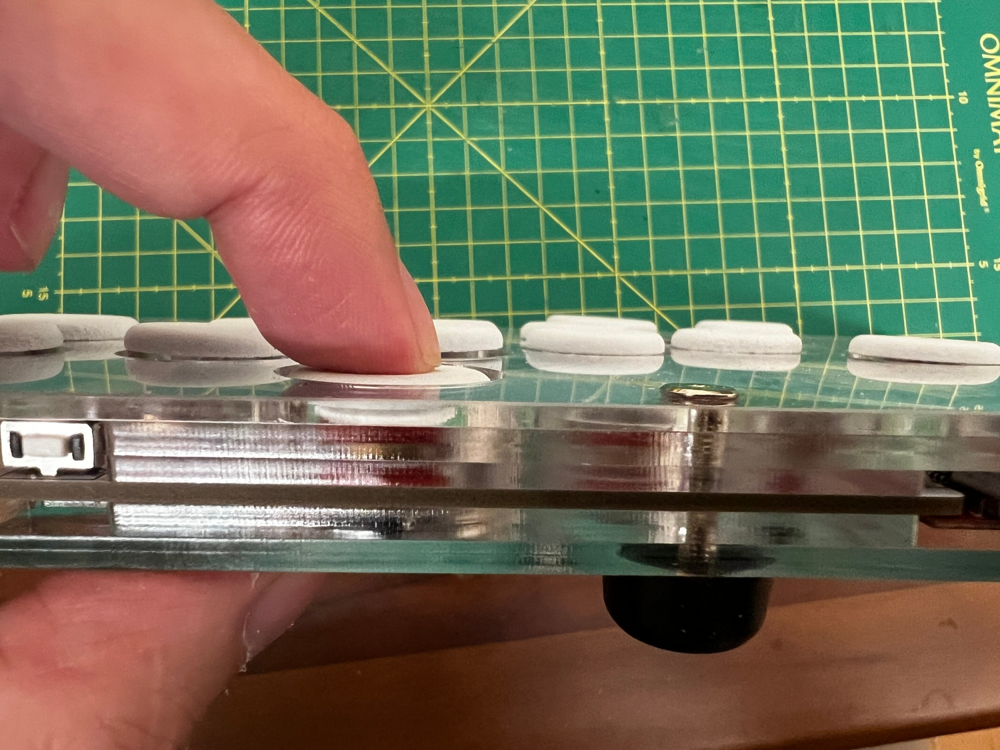

3D Printed Button Cap data
========================================================================

This directory hosts the 3D printable STL files and their original
design data for the ergoSHIFT compatible button caps.

You may use the [Full Set](./ergoSHIFT-FullSetButtonCaps.stl) to order
a full set of key-caps from third parties with SLS or MJF print capabilities,
or you may use other printing solutions using the individual stl files.

You will need 14 of the [small caps](./ergoSHIFT-ButtonCap.stl) and one
[big cap](./ergoSHIFT-ButtonCapBig.stl) for an ergoSHIFT build.

The button caps printed using PA12W MJF print looks something like this on
the ergoSHIFT rev1.

