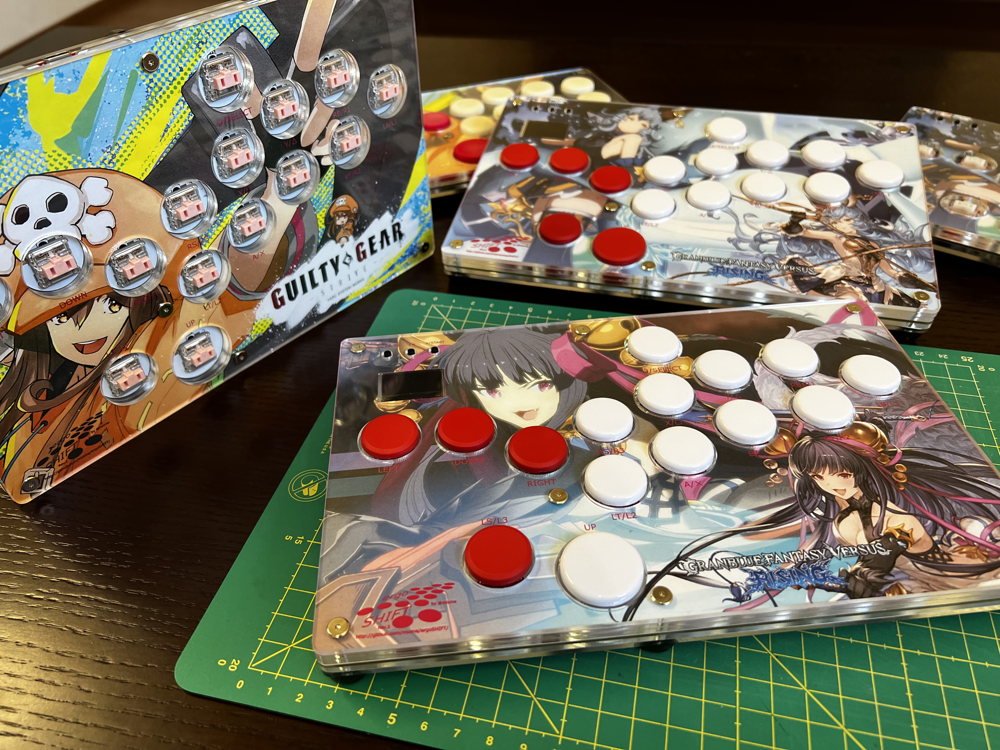
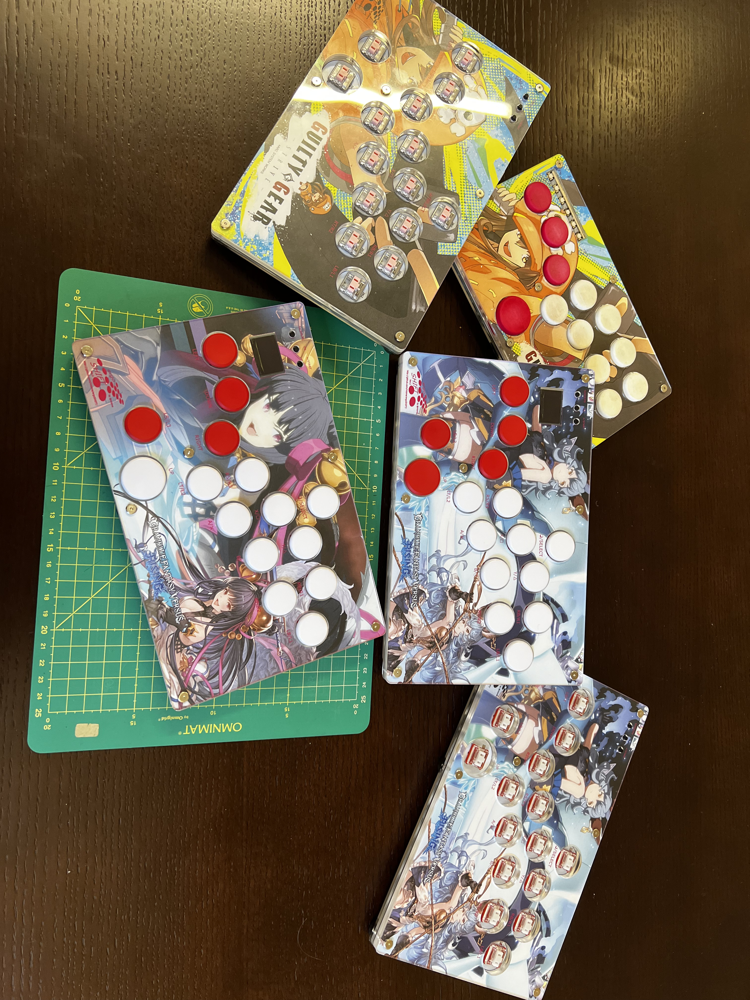

ergoSHIFT arcade controller
========================================================================

_**Low profile 11 button leverless arcade controller with Acrylic shell**_

This repository contains Acrylic cut design files, PCB design files and code needed to make
an arcade controller that look like this:

Also, you can create custom artwork using the stencil provided in each hardware revision folder.

(*) Above sample Artwork based on an In-Game Screenshot + Official Fan-kit (©Cygames & ARK SYSTEM WORKS)

This controller is designed with the following concept:

* Create a reasonably compact and thin leverless arcade controller
* Layout 11 main buttons + 4 directional buttons to work with the latest 
  Capcom Pro-Tour rule-set
* Shift the home position for the main button one column to the right to better utilize the 
  more dextrous thumb and index finger instead of the little finger.
* Add the three additionally allowed buttons
* Make the button size compatible with Snackbox MICRO from [Junkfood Arcades](https://junkfoodarcades.com/)
    * I could not find good Injection molded options other than this one.
* Make the design reversible for southpaw use.
    * To assemble for left hand use, implement all buttons on the other side.
    * Controller Circuit (Pro Micro or RP2040) must be implemented on the same side
    * to compensate for the Controller Cicuitry being implemented in reverse, Acrylic layers will need to be 
      stacked in a different order and thickness.  Refer to each revision README for details

Resulting button mappings will look like this:

There are currently two revisions of the ergoSHIFT.  It uses Kailh low profile (choc v1)
mechanical keyboard switches.  The table below lists their main features.
See the README for each version for details on how to make them.

version                                 | [rev1](./hardware-rev1/)            | [rev2](./hardware-rev2/)              |
--------------------------------------- | ----------------------------------- | ------------------------------------- |
Status                                  | Verified                            | Verified                              |
case dimensions                         | 233.17x147.67x14.6mm (excl. feet)   | 233.17x147.67x14.6mm (excl. feet)     |
compatibility (using provided firmware) | PC, PS3, Xinput, Switch             | PC, PS3, PS4*, PS5*, Xinput, Switch   |
add-on board                            | Sparkfun Qwiic Pro Micro            | SSD1306, SH1106 or SH1107 128x64 oled |
onboard chip                            | -                                   | RP2040                                |
port                                    | USB-C                               | USB-C                                 |
SMT assembly required                   | no                                  | yes                                   |
OLED Support                            | no                                  | yes                                   |
South-paw support                       | yes                                 | yes                                   |
firmware                                | [ATmega32U4](firmwares_atmega32u4)  | [GP2040-CE](https://gp2040-ce.info/)**|

*) for details, see the documentation in the [GP2040-CE PS4/PS5 Compatibility FAQ](https://gp2040-ce.info/faq/faq-ps4-ps5-compatibility)

**) Currently the firmware is not available from the GP2040-CE project page.
See [GP2040 firmware page](./firmware_GP2040-CE/) for
[prebuilt firmware](./firmware_GP2040-CE/GP2040-CE_0.0.0_ergoSHIFTRev2.uf2) and the config files used.

LICENSE
------------------------------------------------------------------------

ergoSHIFT (c) by mizma

ergoSHIFT is licensed under a
Creative Commons Attribution-ShareAlike 4.0 International License.

You should have received a copy of the license along with this
work. If not, see <https://creativecommons.org/licenses/by-sa/4.0/>.

Some portions of the work uses derivative works of other libraries and or implementations.
Firmware and hardware designs are separately licensed depending on the licensing terms of 
the works it uses.  Refer to the LICENSE files or README for the relevant terms for each
component.
