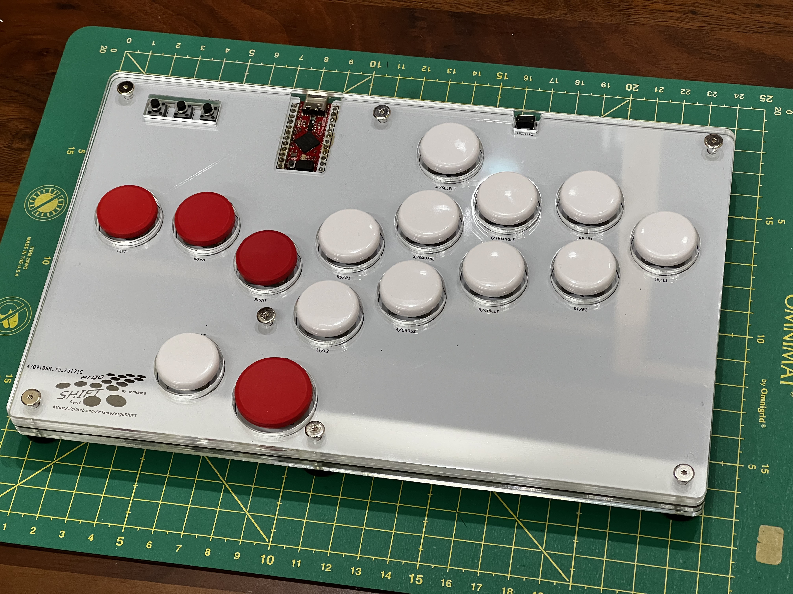
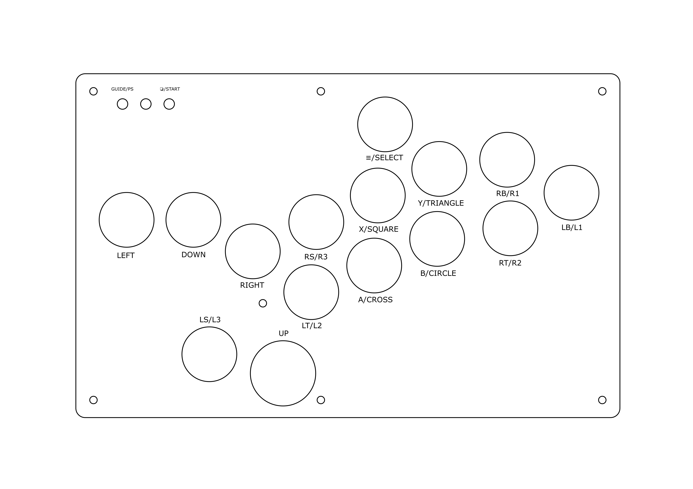
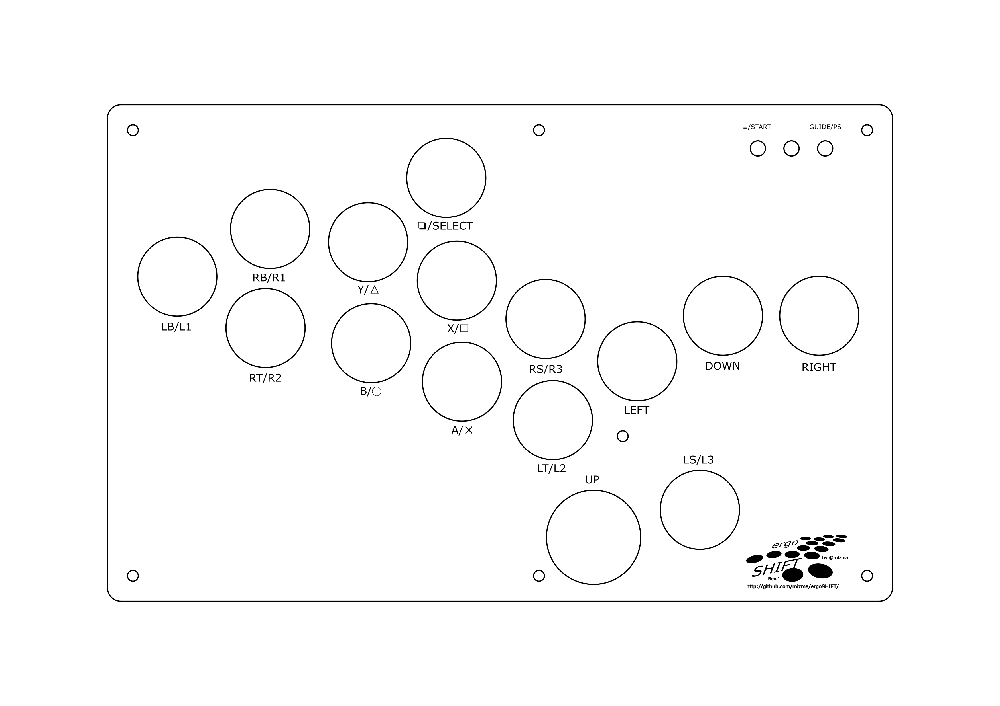

ergoSHIFT arcade controller
========================================================================

_**Low profile 11 button leverless arcade controller with Acrylic shell**_

This repository contains Acrylic cut design files, PCB design files and code needed to make
an arcade controller that look like this:

This controller is designed with the following concept:

* Create a compact and thin leverless arcade controller
* Layout 11 main buttons + 4 directional buttons to work with the latest 
  Capcom Pro-Tour rule-set
* Shift the home position for the main button one column to the right 
  to releave your pinky from the lower right button.
* Add the three additionally allowed buttons
    * One on the left of the Jump button.  (intended for defensive buttons)
    * One on the top-left.
    * One above the index-middle finger position.
* Make the button size compatible with Snackbox MICRO from [Junkfood Arcades](https://junkfoodarcades.com/)
* make the design reversible for lefty use.
    * To assemble for left hand use, implement all buttons on the other side.
    * Controller Circuit (Pro Micro or RP2040) must be implemented on the same side
    * to compensate for the Controller Cicuitry being implemented in reverse, Acrylic layers will need to be 
      stacked in a different order and thickness.  Refer to each revision README for details

Resulting button mappings will look like this:

There is currently one revision of the ergoSHIFT.  It uses Kailh low profile (choc v1)
mechanical keyboard switches.  The table below lists their main features.
See the README for each version for details on how to make them.

version                                 | [rev1](./hardware-rev1/)            | [rev2](./hardware-rev2/)              |
--------------------------------------- | ----------------------------------- | ------------------------------------- |
Status                                  | Verified                            | Initial build on-goind                |
case dimensions                         | 233.17x147.67x13.6mm                | 233.17x147.67x13.6mm                  |
compatibility (using provided firmware) | PC, PS3, Xinput, Switch             | PC, PS3, PS4*, PS5*, Xinput, Switch   |
add-on board                            | Sparkfun Qwiic Pro Micro            | SH1106 128x64 oled screen             |
onboard chip                            | -                                   | RP2040                                |
port                                    | USB-C                               | USB-C                                 |
SMT assembly required                   | no                                  | yes                                   |
OLED Support                            | no                                  | yes                                   |
South-paw support                       | yes                                 | yes                                   |
firmware                                | [ATmega32U4](firmwares_atmega32u4)  | [GP2040-CE](https://gp2040-ce.info/)  |

*) for details, see the documentation in the [GP2040-CE PS4/PS5 Compatibility FAQ](https://gp2040-ce.info/faq/faq-ps4-ps5-compatibility)

LICENSE
------------------------------------------------------------------------

ergoSHIFT (c) by mizma

ergoSHIFT is licensed under a
Creative Commons Attribution-ShareAlike 4.0 International License.

You should have received a copy of the license along with this
work. If not, see <https://creativecommons.org/licenses/by-sa/4.0/>.

Some portions of the work uses derivative works of other libraries and or implementations.
Firmware and hardware designs are separately licensed depending on the licensing terms of 
the works it uses.  Refer to the LICENSE files or README for the relevant terms for each
component.
