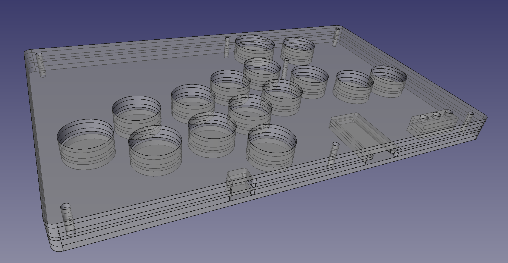

ergoSHIFT arcade controller
========================================================================

_**Low profile 11 button leverless arcade controller with Acrylic shell**_

This repository contains Acrylic cut design files, PCB design files and code needed to make
an arcade controller that look like this:

TODO: replace with actual procuct image

This controller is designed with the following concept:

* Create a compact and thin leverless arcade controller
* Layout 11 main buttons + 4 directional buttons to work with the latest 
  Capcom Pro-Tour rule-set
* Shift the home position for the main button one column to the right 
  to releave your pinky from the lower right button.
* Add the three additionally allowed buttons
    * One on the left of the Jump button.  (intended for defensive buttons)
    * One on the top-left.
    * One above the index-middle finger position.

Resulting button mappings will look like this:

There is currently one revision of the ergoSHIFT.  It uses Kailh low profile (choc v1)
mechanical keyboard switches.  The table below lists their main features.
See the README for each version for details on how to make them.

version | [rev1](./hardware-rev1/) |
------- | ------------------------- |
case dimensions | 233.17x147.67x13.6mm |
compatibility (using provided firmware) | PC, PS3, Xinput, Switch |
add-on board | Sparkfun Qwiic Pro Micro |
onboard chip | - |
port | USB-C |
SMT assembly required | no |
firmware | [ATmega32U4](firmwares_atmega32u4) |