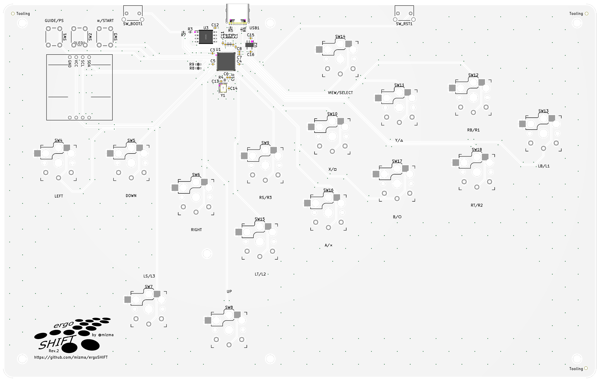
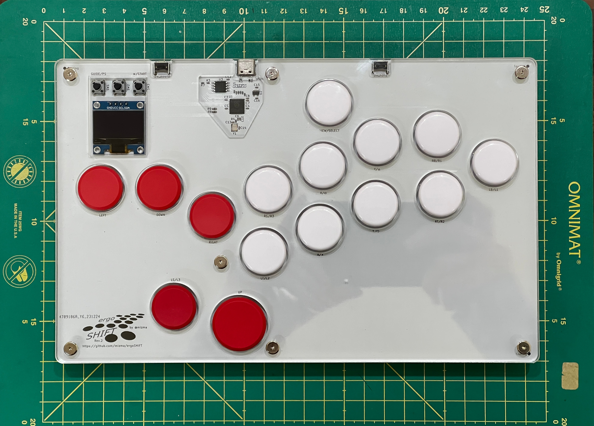
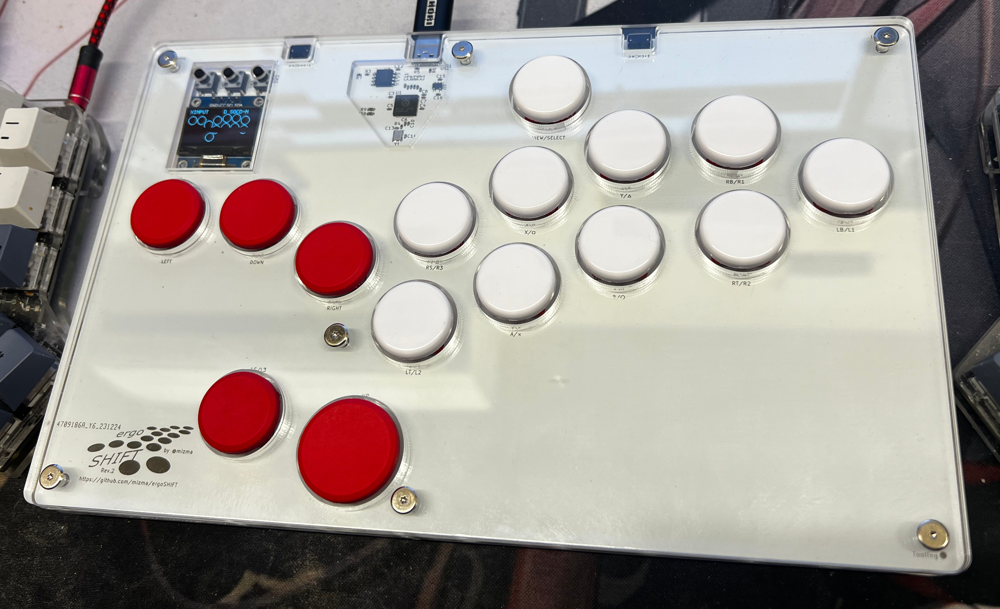
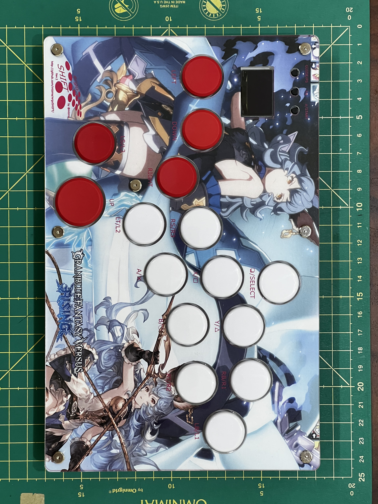
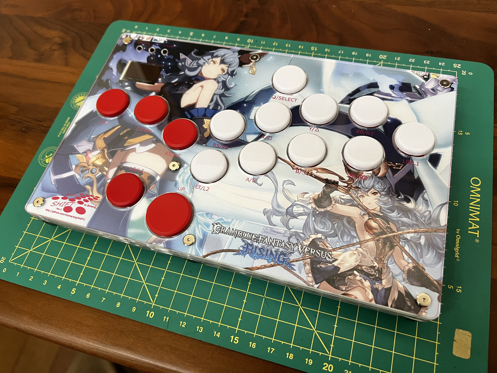
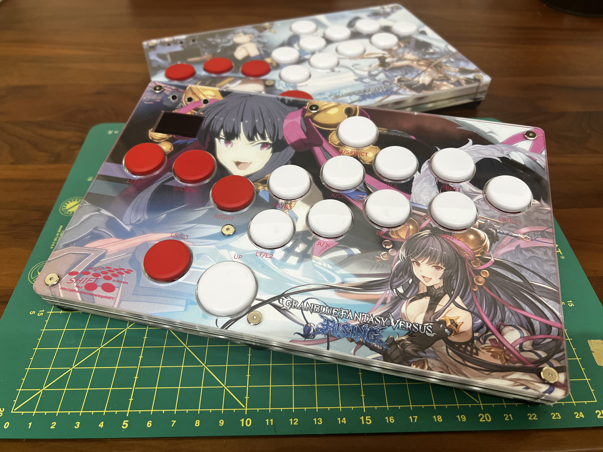
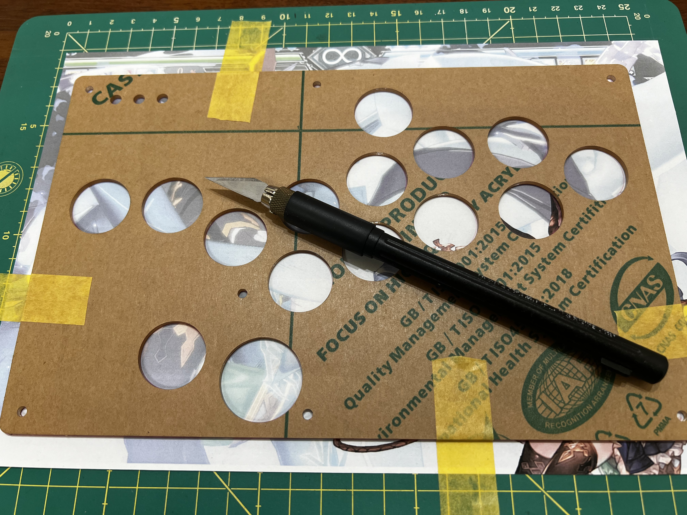

ergoSHIFT rev2
========================================================================

This is rev2 of the ergoSHIFT.  In this version, RP2040 circuitry is
implemented on the PCB.

To make one you will need:

* [acrylic shell](./acrylic-shell/)
    * For Standard Layout stackup (From bottom to top)
        * acryl-design-ergoSHIFT-Acrylic-layer-01: 2mm
        * acryl-design-ergoSHIFT-Acrylic-layer-02: 3mm
        * PCB
        * acryl-design-ergoSHIFT-Acrylic-layer-03: 3mm
        * acryl-design-ergoSHIFT-Acrylic-layer-04: 3mm
        * acryl-design-ergoSHIFT-Acrylic-layer-05: 2mm
    * For Reverse Layout (Left handed, from bottom to top)
        * acryl-design-ergoSHIFT-Acrylic-layer-01: 2mm
        * acryl-design-ergoSHIFT-Acrylic-layer-03: 3mm (to compensate for PCB being flipped upside down)
        * PCB
        * acryl-design-ergoSHIFT-Acrylic-layer-04: 3mm
        * acryl-design-ergoSHIFT-Acrylic-layer-04: 3mm
        * acryl-design-ergoSHIFT-Acrylic-layer-05: 2mm
* [the ergoSHIFT PCB](./pcb/)
* 15x Kailh low profile (choc v1) switches of your choice
    * I use Kailh Choc v1 Red Pro (Linear and low activation force: 35±10gf with actuation travel: 1.5±0.5mm)
    * Others like Light Blue (gChoc) or Pink can be used for even lower actuation force.
* (optionally) 15x Kailh low profile hotswap sockets
    * Can be ordered from LCSC with part number [C5333465](https://www.lcsc.com/product-detail/Mechanical-Keyboard-Shaft_Kailh-CPG135001S30_C5333465.html)
* (optionally) SSD1306 driver based 0.96 inch OLED module with PCB size aprox. 25.4mm x 26.1mm
    * You may choose to omit R8 and R9 on PCB if display is not implemented.
* Button Caps (Choose one)
    * [MICRO keycap set](https://junkfoodarcades.com/collections/micro-accessories)
        * You will need to buy two sets of Snackbox Micro keycap sets.
    * [3D printed buttoncaps](../3d-printed-buttoncaps)
* 3x 6x6x8.51mm tact switches
    * I Used [TE Connectivity 3-1825910-5](https://www.te.com/ja/product-3-1825910-5.html).  You 
      can order from LCSC with part number [C592733](https://www.lcsc.com/product-detail/Tactile-Switches_TE-Connectivity-3-1825910-5_C592733.html)
    * Digikey part number: [450-1644-ND](https://www.digikey.com/en/products/detail/te-connectivity-alcoswitch-switches/3-1825910-5/1632530)
    * Make sure the switch head is tall enough.  Otherwise, you will not be able to press the button.
* 2x 3x6x4.3 horizontal tact switch
    * https://www.newegg.com/p/2S7-01KR-035X0
    * https://shop.yushakobo.jp/collections/all-keyboard-parts/products/a1600ed-01-1
    * You can also order from LCSC with part number [C18078123](https://www.lcsc.com/product-detail/Tactile-Switches_Bossie-BX-TS-26-3643ZJ_C18078123.html)
    * MJTP1117/PHAP3363 from DigiKey should work as well [679-2400-ND](https://www.digikey.com/en/products/detail/apem-inc/MJTP1117/1795496)
    * [schematics](images/tactile-switch_3x6x4.3.jpg)
* 7x M3 screws (length 20mm)
    * Case stackup height = 14.6mm
        * Acryl stackup = 2mm * 2 + 3mm * 3 = 13mm
        * +PCB 1.6mm = 14.6mm
    * Rubber feet fastening depth
        * Rubber feet screw hole depth = 3mm (using rubber feet below.  adjust for your part)
        * +M3 nut height 2mm = 5mm
    * Rubber feet total depth = 8mm (using rubber feet below.  adjust for your part)
    * min length required for proper fastening (using rubber feet below.  adjust for your part)
        * min length = 14.6+5 = 19.6mm
    * max length without extruding out the bottom (using rubber feet below.  adjust for your part)
        * max length = 14.6+8 = 22.6mm
* 7x M3 nut and acompanying rubber feet
    * Rubber feet Tochigiya [TM-TK-15](https://www.monotaro.com/p/0933/2486/?displayId=5)
    * The position of the holes are intended for feet radius of less than 7.5mm
    * You may use any rubber feet compatible with M3 screws with following constraints:
        * diameter less than 15mm (otherwise it will extrude out the side)
        * need to be compatible with the M3 screws you chose above
            * Check threading pitch.
        * make sure the screw is long enough to be able to fasten the feet, but not
          too long it extrudes past the feet.
        * choose one with washers built in, or place one yourself.
* a soldering iron and other tools
    * something with enough power is better 
      (i.e. [Hakko FX 600](https://www.hakko.com/japan/products/hakko_fx600_set.html))
    * I recommend changing tips to D type for most Through-hole soldering, or C type if you plan to
      solder SMT as well. (default B tips are harder to use for most PCB soldering)
    * Use 320C ~ 370C temp recommended (can be changed if you know your way around)

## Assembly Instructions

### Ordering PCB

I used [JLCPCB](https://jlcpcb.com/).  Just upload the gerber files in [pcb](pcb) and keep most parameters default.
You may change PCB Qty and PCB Color if you like.  All other parameters should be kept the same.

Here are the settings I use:

* Base Material: FR-4
* Layers: 2
* Dimensions: Keep as is
* PCB Qty: select as many as you like.
* Product Type: Industrial/Consumer electronics
* Different Design: 1
* Delivery Format: Single PCB
* PCB Thickness: 1.6
* PCB Color: Choose what you like
    * JLCPCB may have some restriction on color if you wish to do PCB Assembly as well
* Silkscreen: Choose what you like
* Surface Finish: HASL(with lead)
* Outer Copper Weight: 1oz
* Via Covering: Tented
* Board Outline Tolerance: 0.2mm
* Confirm Production File: No
* Remove Order Number: Choose (No: JLC will put order number SILKSCREEN on the PCB somewhere.  Setting to Yes will remove this for a small additional cost)
* Gold Fingers: No
* Castellated Holes: No
* Edge Plating: No

#### SMT assembly

You may either order the stencil when ordering PCB and impelemnt the parts yourself, or you can select Part
assembly and use the BOM file and CPL file in [pcb](pcb).

Options Used for SMT Assembly at JLCPCB:

* PCBA Type: Economic
* Assembly Side: Top Side
* PCBA Qty: Choose
* Tooling holes: Added by Customer
* Confirm Parts Placement: Yes (This will make sure JLC will check if the parts are aligned and stop if they see any annomalies)

For Advanced Options, Keep as default.

If you select PCBA and select next, the site will ask for uploading the BOM and CPL file.
Upload the files in [pcb](pcb) folder and select Next to the Component Placements where you
should see the following:

Check to make sure that all parts are aligned (see if components are placed as shown in image, 
and the purple dots are in the same position).  BOM and CPL file has been checked on 2024/01/06 and should
work out of the box.  If there are any anomallies, stop and ask for help in the issues (possible issues
include parts shortage, parts design revision etc. that break the BOM and CPL).

If you wish to implement the SMT parts yourself, toggle the "Order together with PCB" in the stencil section to ON.
Check for the BOM file for the actual components used.  Search on [LCSC](https://www.lcsc.com/)
with LCSC part number to figure out what parts are used.

You will need a fairly large SMT reflow oven, soldering hotplate (recommended) that can fit the PCB
or at least a soldering hot air gun.

There are some tutorials on [Hot Plate Reflowing](https://www.sparkfun.com/tutorials/59#Hot%20Plate%20Reflowing)
if you're feeling adventurous.

### Ordering or Making Buttons

#### Snackbox Micro button caps

ergoSHIFT is compatible with Snackbox Micro button caps.

You can purchase them [HERE](https://junkfoodarcades.com/collections/micro-accessories)

You will need at least two sets since ergoSHIFT has more buttons.

#### 3D printed buttons

_**Currently verifying design**_

If you have a 3D printer, print at your own will.  Files are found [here](../3d-printed-buttoncaps/).

* [ergoSHIFT-ButtonCapBig.stl](../3d-printed-buttoncaps/ergoSHIFT-ButtonCapBig.stl) 
  is used for the thumb button. 1 board needs 1 of this button.
* [ergoSHIFT-Buttoncap.stl](../3d-printed-buttoncaps/ergoSHIFT-ButtonCapBig.stl) is used for all other buttons.
  1 board needs 14 of this button.
* [ergoSHIFT-FullSetButtonCaps.stl](../3d-printed-buttoncaps/ergoSHIFT-FullSetButtonCaps.stl) is an STL file 
  containing 1 full set of buttons + extra(26 small and 2 big.).  If your 3D printing service allows 28 or more shells, it may be cheaper to print in one batch using this STL file.
    * Print size needs to be bigger than X：99.4901mm x Y： 91.7951mm x Z： 15.0000mm
    * To accomodate for the buttons in the 100mm x 100mm x 100mm size limit in some Printing services,
      This STL file has two layers of buttons arranged on top of each other.  This type of layout is only
      possible on print technology such as SLS or MJF.  Check with your 3D Printing service.
    * If your 3D Printing service does not support this type of data, use individual cap data to print.

Insertion portion may need to be adjusted in size for your 3D Printer and settings to fit snugly to the switch.
You may use some of the printer features but if that doesn't work, you might want to edit the original model.
Model data are found in [here](../3d-printed-buttoncaps/design_data/) in a [FreeCAD](https://www.freecadweb.org/)
file format.

Also, since the insertion portion requires a fairly tight tolerance which is not easily achieved by 3D printers,
the models are modelled slightly on the larger side.

I have had fairly good results with this model using SLS/MJF Nylon print but sometimes it is too large.
If the legs turn out too large to fit, use sandpaper to adjust the width of the legs.

#### Materials Consideration

* Nylon
    * May be a good place to start for tensile strength and good chemical stability.
    * can be pretty strong if printed using SLS process at some printing services
    * may be prone to warping.  not good for humid places.
* UV Resin
    * Also pretty strong as a material, and stronger to humidity.
    * Maybe slightly more brittle than Nylon

### Ordering Acrylic cuts

I use [Elecrow](https://www.elecrow.com/acrylic-cutting.html) to cut acrylic.

Upload the .zip file in [acrylic-shell](acrylic-shell/) to the Elecrow Acrylic cut service to order.
.zip file includes the dxf file and a drawing PDF for reference.

Use the following thickness:

* For Standard Layout stackup (From bottom to top)
    * acryl-design-ergoSHIFT-Acrylic-layer-01: 2mm
    * acryl-design-ergoSHIFT-Acrylic-layer-02: 3mm
    * PCB
    * acryl-design-ergoSHIFT-Acrylic-layer-03: 3mm
    * acryl-design-ergoSHIFT-Acrylic-layer-04: 3mm
    * acryl-design-ergoSHIFT-Acrylic-layer-05: 2mm
* For Reverse Layout (Left handed, from bottom to top)
    * acryl-design-ergoSHIFT-Acrylic-layer-01: 2mm
    * acryl-design-ergoSHIFT-Acrylic-layer-03: 3mm (to compensate for PCB being flipped upside down)
    * PCB
    * acryl-design-ergoSHIFT-Acrylic-layer-04: 3mm
    * acryl-design-ergoSHIFT-Acrylic-layer-04: 3mm
    * acryl-design-ergoSHIFT-Acrylic-layer-05: 2mm

The original design file (FreeCAD file) can be found [here](./design_data/acryl-design/).

The Acrylic should look like the following (with PCB stacked)

(*) Above image is for standard layout (right handed)

### Assembly

1. Solder all the Choc v1 switches and the tactile switches.  make sure you populate the side with the other
   SMT components.
    * If you populate the side with the logo on the left, the buttons only goes in in the correct orientation.
        * For reverse layout, implement the buttons on the other side.
    * If you use the hot-swap sockets, those will go on the other side. (see silk screen on back side for
      orientation)
        * For hotswap sockets, pre-solder one side of the pad on PCB, place the socket, heat the pre-solder while
          pressing down on the socket to attach the socket.  After It is attached, solder the other side fully
          and then add more solder on the pre-soldered side.
2. Solder the OLED screen.  See the silkscreen for the orientation of the pins.
    * For standard layout, the pins should be soldered to the top 4 through-holes lining up from left to right:
      GND, VCC, SCL, SDA
    * For southpaw layout, the pins should be soldered to the bottom 4 through-holess with pins from left
      to right: SDA, SCL, VCC, GND
3. stack the Acryl and PCB in following order: Layer 01, Layer 02, PCB, Layer 03, Layer 04 and Layer 05.
    * for reverse layout, stack in the order: Layer 01, Layer 03, PCB, Layer 04, Layer 04 and Layer 05.
    * For details on how to build southpaw version, see the [Readme_southpaw](./README_southpaw.md)
4. Screw on the M3 screws with the nut on all 7 locations.  Rubber feet should be inserted at least in the
   corners between the nut and the acrylic.
    * putting rubber feet on all positions makes shure the board does not flex during use.

It should look like the following when assembled.

### Pro-Tip 1. Filing the Acrylic Edges

Acrylic Edges after laser cutting can be quite sharp and do not feel good.
You may want to file the edges with sandpaper (#400 is a nice place to start) to remove the edges 
on the top acrylic layer you don't cut yourself.

### Pro-Tip 2. Customizing design

You can also insert some artwork below the top acrylic layer as below:

(*) Above sample Artwork based on In-Game Screenshot + Official Fan-kit (©ARK SYSTEM WORKS)

Stencil for the artwork can be found below (Page Size set to A4):

* [Stencil SVG](./images/ergoSHIFT-stencil-with-OLED.svg)
* [Stencil PNG 300dpi](./images/ergoSHIFT-stencil-with-OLED.png)
* [Backplate Stencil SVG](./images/ergoSHIFT-backplate-stencil-with-OLED.svg)
* [Backplate Stencil PNG 300dpi](./images/ergoSHIFT-backplate-stencil-with-OLED.png)
* [Southpaw Stencil SVG](./images/ergoSHIFT-stencil-with-OLED-reversed.svg)
* [Southpaw Stencil PNG 300dpi](./images/ergoSHIFT-stencil-with-OLED-reversed.png)
* [Southpaw Backplate Stencil SVG](./images/ergoSHIFT-backplate-stencil-with-OLED-reversed.svg)
* [Southpaw Backplate Stencil PNG 300dpi](./images/ergoSHIFT-backplate-stencil-with-OLED-reversed.png)

To cut the stencil, use one of the top acrylic plates as cutting guides (don't trust the acuracy
of the printed stencil mark, they are good enough to use as design guide, but not acurate enough for 
final cutting guide).  It is easy to cut if you tape the plate on top of the print.

For the OLED display portion, use Layer-04 acrylic for the sides and use the print mark for the
horizontal cuts.

## Donations

This project is completely opensource.  If you feel you would like to donate, please consider donating
to the any of the projects refered to below in the License and Acknowlegements section.

Or join the [GP2040-CE](https://gp2040-ce.info/) community project that made this project possible and
help others with similar needs.

## License and Acknowlegements

PCB design licensed under [CC BY-SA 4.0](https://creativecommons.org/licenses/by-sa/4.0/) by mizma

Acrylic sandwitching shell heavily inspired by [Mille-Feuille](https://pomegd.booth.pm/items/2685530) 
by [@pomegd](https://twitter.com/pomegd)

PCB design uses the following libraries or derivatives of the design:

* [keyswitches.pretty](https://github.com/daprice/keyswitches.pretty) by [daprice](https://github.com/daprice) ([CC BY-SA 4.0](https://creativecommons.org/licenses/by-sa/4.0/))
* [Type-C.pretty](https://github.com/ai03-2725/Type-C.pretty) by [ai03-2725](https://github.com/ai03-2725)
* RP2040 library from [Hardware design with RP2040](https://datasheets.raspberrypi.org/rp2040/hardware-design-with-rp2040.pdf) Chapter 2. Minimal design example.

Portions of the PCB layout and parts selection has been referenced from the following builds:

* [Open_Core0](https://github.com/OpenStickCommunity/Hardware/tree/main/Open_Core0) by [TheTrain](https://github.com/TheTrainGoes) ([Licensed under CC BY 4.0](https://creativecommons.org/licenses/by/4.0/))
* [flatbox rev.4](https://github.com/jfedor2/flatbox/tree/master/hardware-rev4) by [jfedor](https://github.com/jfedor2) ([licensed under CC BY-SA 4.0](https://creativecommons.org/licenses/by-sa/4.0/))
