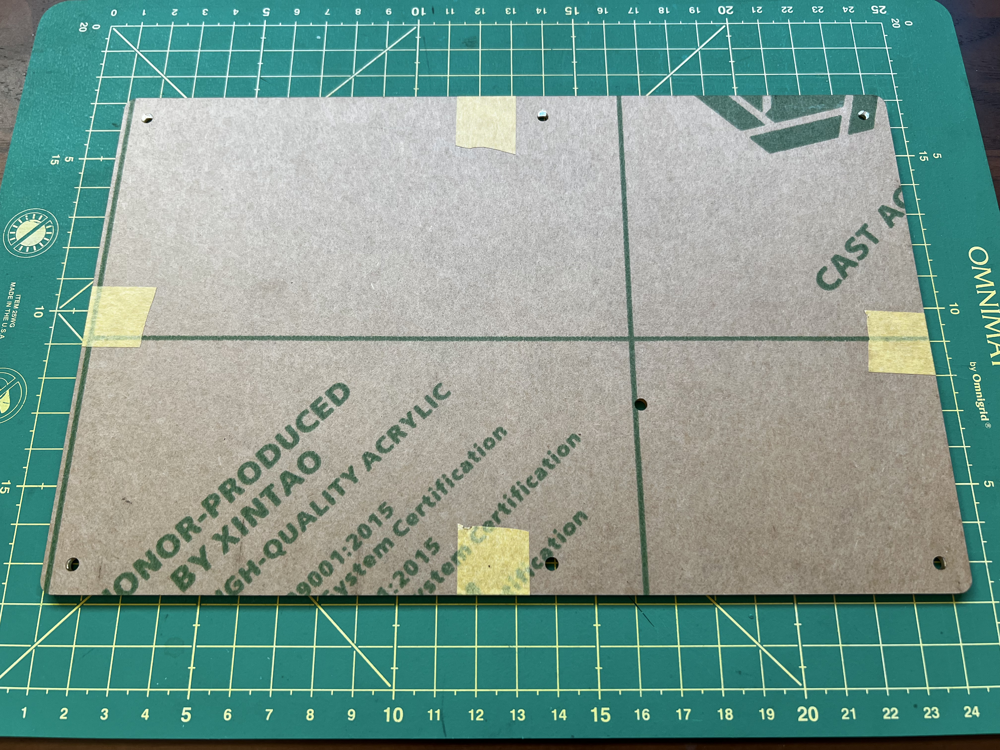
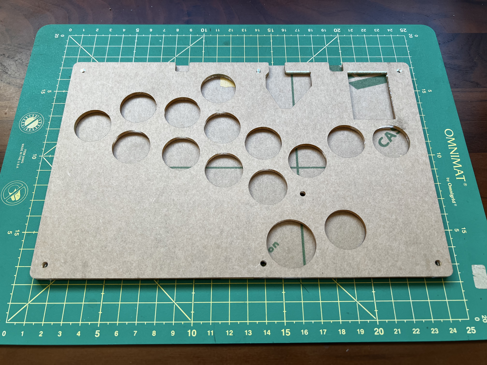
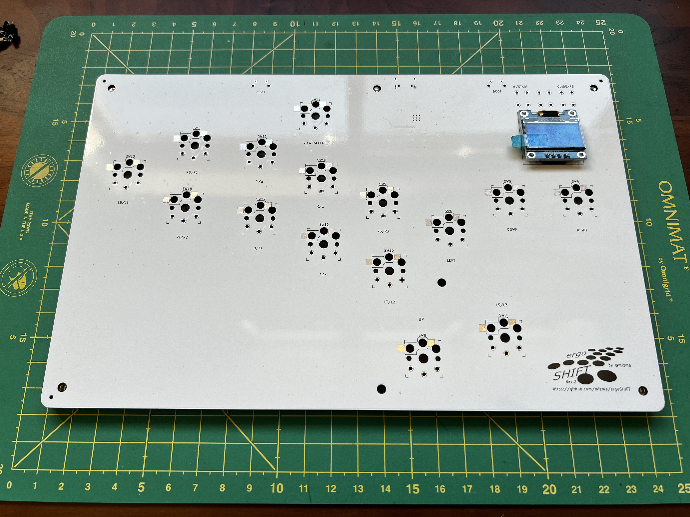
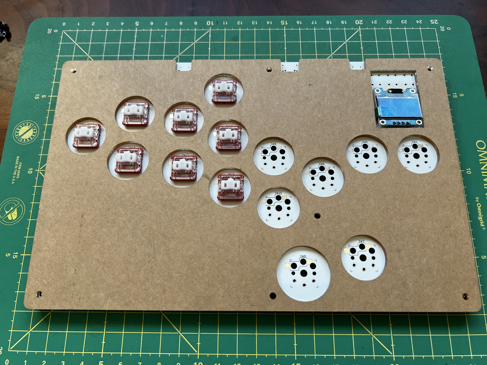
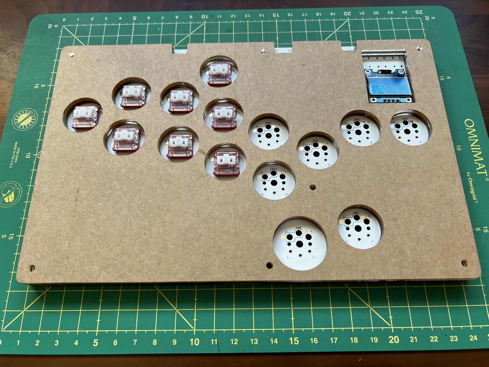
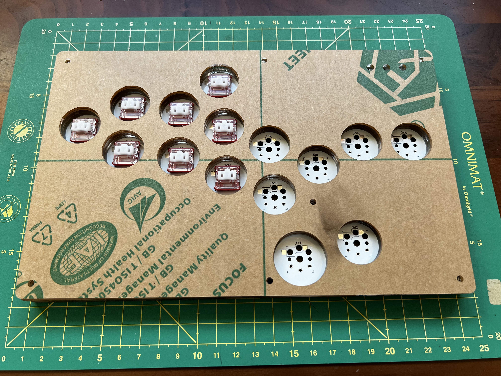
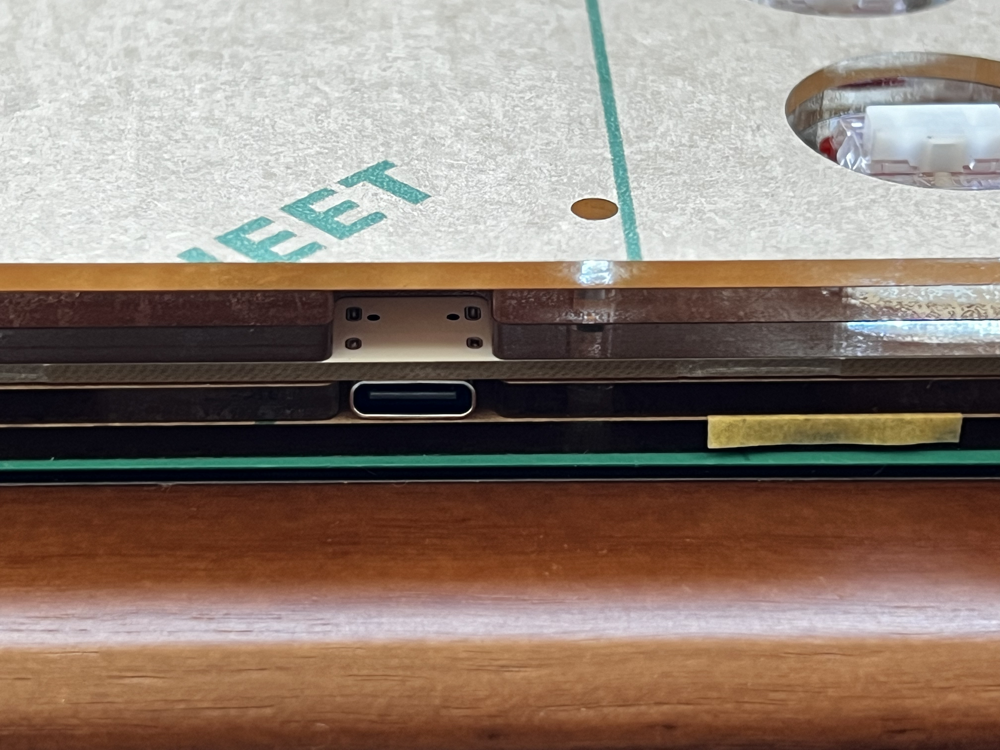

Stackup for Southpaw build
========================================================================

ergoSHIFT PCB is built to be reversible, and using the Acrylic shell
in slightly different order, you can make a southpaw version.

The only difference are the stackup and acrylic shell parts configuration.

Acrylic Parts
------------------------------------------------------------------------

You will need to order the parts slightly differently for southpaw version.
You do not need the Layer 2 version.

* acryl-design-ergoSHIFT-Acrylic-layer-01: 2mm
* acryl-design-ergoSHIFT-Acrylic-layer-03: 3mm (to compensate for PCB being flipped upside down)
* PCB
* acryl-design-ergoSHIFT-Acrylic-layer-04: 3mm
* acryl-design-ergoSHIFT-Acrylic-layer-04: 3mm
* acryl-design-ergoSHIFT-Acrylic-layer-05: 2mm
* all other buttons and OLED used are the same.

Stackup
------------------------------------------------------------------------

1. First layer is the same.  Just make sure the screw holes are as shown
   in the picture
   
2. Second layer we use the Layer-03 file because SMT components will be
   upside-down.
   
3. Place the PCB upside-down.  The OLED also needs to go to the bottom
   holes, NOT the top holes.  Follow the visible SILKSCREEN for OLED
   
4. Third and forth layer, we use Layer-04 file since no SMT components
   are on this side.
   
   
5. Final Layer is the same.
   
6. For the USB-C port, you may need to grind down the first layer if
   the USB port is hitting the first acrylic layer since it is a very tight fit.
   

For the rest of the build, follow the [README](./README.md)