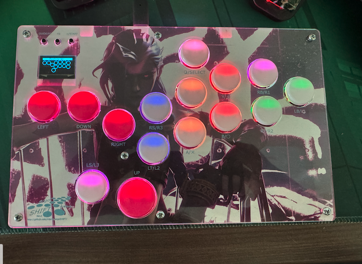

ergoSHIFT rev RGB
========================================================================

This is a RGB rev of the ergoSHIFT.  In this version, RGB LEDs were added to each Kailh button and can be assembled onto the board by JLCPCB (or another fab house), similar to the other SMT parts. 

The firmware from the [Original GP2040-CE website](https://gp2040-ce.info/downloads) will work along with enabling the RGB LED via the GP2040-CE Web Configurator.
You may also use the firmware in the [Firmware Directory](../firmware_GP2040-CE/) which support original OLED display layout.

This version of Ergoshift has been modified to only work in the standard (non Southpaw) configuration so that there is PCB area for RGB LEDs. The Kailh sockets are also required for this version (rev2 can use Kailh sockets or switches directly) and can only be installed in the normal configuration.

All other assembly steps are the same as the hardware-rev2 steps
